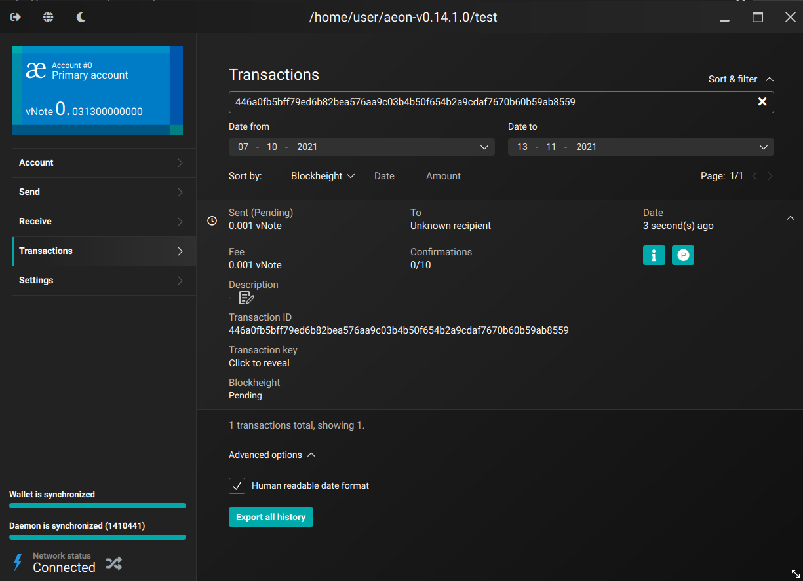

# aeon-gui

The user friendly interface for managing your vNote funds. It has all the features you need in one package. This is based on the latest monero-gui version. See [LICENSE](LICENSE) and [BUILD](BUILD.md) for more information.

